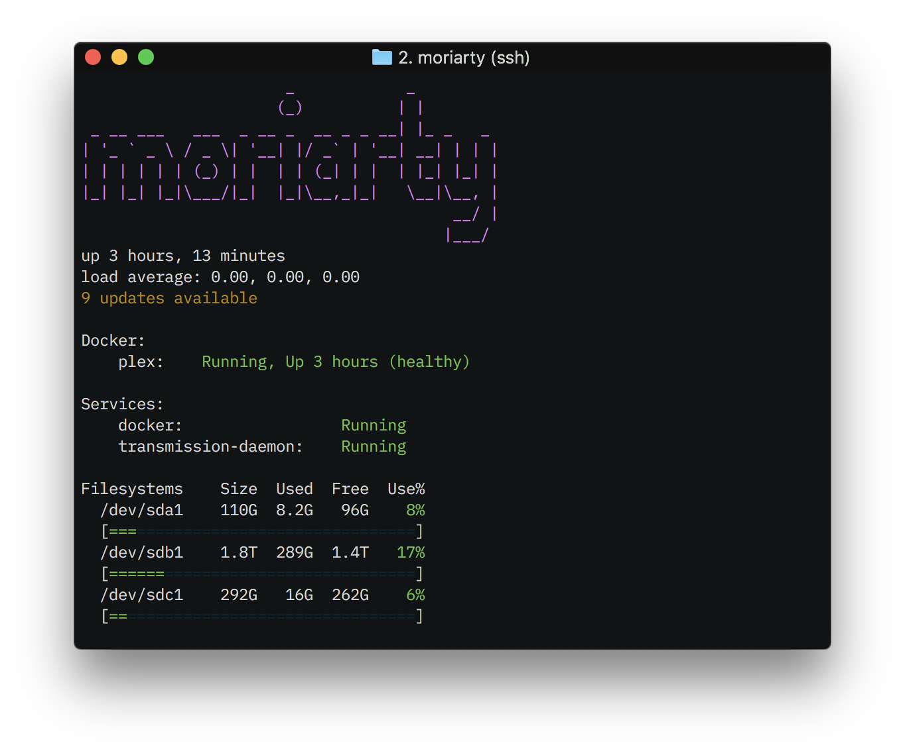

# Howe

**Howe** provides a replacement for MOTD. Its contents can be customised in
order to provide relevant information about your system.



## Installing

Use the [releases](https://github.com/victorgama/howe/releases) to get the
latest version for your platform. In case your platform isn't available, please
[open an issue](https://github.com/victorgama/howe/issues/new/choose) or build from
source.

After downloading:

1. Place `howe` in your `/bin` or `/usr/local/bin` directory
2. Copy the [default configuration](support/config.default.yml) to
`/etc/howe/config.yml`, editing it as you wish.
3. Backup your `/etc/update-motd.d`
4. Backup your `/etc/update-motd.d`
5. **Backup your** `/etc/update-motd.d`
6. Remove all files from `/etc/update-motd.d`
7. Create a new file, `/etc/update-motd.d/00-howe`, with the following contents:
```bash
#!/bin/sh
/bin/howe # or /usr/local/bin/howe, or just howe, depending on how your system
          # is configured
```
8. Ensure `/etc/update-motd.d/00-howe` is executable

## Configuring

Howe contains several widgets that collects and processes system information
every time the utility is executed. Widgets can be configured through the
configuration file stored in `/etc/howe/config.yml`, which has the following
structure:

```yaml
howe:
  - type: widget-name-here
    widget-options: here
  - type: other-widget-name-here
    more-options: here
  [...]
```

### Available Widgets

#### Banner
Banner displays an ASCII-Art (Figlet) using the output of a command or static
text. Examples:

```yaml
  - type: banner
    text: Howe
  # Outputs a static text
  #  _    _
  # | |  | |
  # | |__| | _____      _____
  # |  __  |/ _ \ \ /\ / / _ \
  # | |  | | (_) \ V  V /  __/
  # |_|  |_|\___/ \_/\_/ \___|

  - type: banner
    command: whoami
  # Outputs the output of the command:
  #                  _
  #                 | |
  #  _ __ ___   ___ | |_
  # | '__/ _ \ / _ \| __|
  # | | | (_) | (_) | |_
  # |_|  \___/ \___/ \__|
```

> **Notice**: Figlets will be wrapped at 80 columns.

#### Blank
Blank simply outputs a blank line. Example:
```yaml
  - type: print
    text: Hello
  - type: blank
  - type: print
    text: Workd
  # Outputs:
  # Hello
  #
  # World
```

#### Disks
Lists all or a range of disks. Example:
```yaml
  - type: disks
    disks:
     - '*'
  # Placing a single disk named '*' will cause all disks to be displayed.
  # Filesystems    Size  Used  Free  Use%
  #   sysfs          0     0     0     0%
  #   [=================================]
  #   proc           0     0     0     0%
  #   [=================================]
  #   udev         945M    0   945M    0%
  #   [=================================]
  #   devpts         0     0     0     0%
  #   [=================================]
  #   [...]
```

> **Notice**: Using `'*'` is not recommended, since it clobbers the output.
> Also, `'*'` will cause Howe to be unable to output disk information for
> some users, since it requires elevated privileges to access certain
> mountpoints.

```yaml
  - type: disks
    disks:
     - '/dev/sda1'
     - '/dev/sdb1'
     - '/dev/sdc1'
  # Providing paths for the devices makes Howe to list only provided devices:
  # Filesystems    Size  Used  Free  Use%
  # /dev/sda1    110G  8.2G   96G    8%
  # [=================================]
  # /dev/sdb1    1.8T  289G  1.4T   17%
  # [=================================]
  # /dev/sdc1    292G   16G  262G    6%
  # [=================================]
```

#### Docker
Lists status of provided Docker containers. Examples:
```yaml
  - type: docker
    containers:
      - plex
  # Outputs all listed containers:
  # Docker:
  #     plex:    Running, Up 2 hours (healthy)
```

This widget also allows regexes to be used as the container name, through the
`regexp:` prefix:

```yaml
  - type: docker
    containers:
      - regexp:^pl.{2}$
  # Outputs containers whose names matches the provided regexp:
  # Docker:
  #     plex:    Running, Up 2 hours (healthy)
```

#### Load
Load displays current system load. It takes no arguments.

```yaml
  - type: load
  # Outputs system load average:
  # load average: 0.01, 0.03, 0.00
```

#### Print
Much like [`banner`](#banner), but more discreet. Just like `banner`, `print`
can also take a command as input.

```yaml
  - type: print
    text: Howe
  # Outputs a static text
  # Howe

  - type: print
    command: whoami
  # Outputs the output of the command:
  # root
```

#### systemd-services
Displays status of provided systemd units.

```yaml
  - type: systemd-services
    services:
      - docker
      - transmission-daemon
  # Outputs the status of each provided unit:
  # Services:
  #  docker:                 Running
  #  transmission-daemon:    Running
```

#### Updates
On Debian systems, attempts to provide the number of available updates. It takes
no arguments.

```yaml
  - type: updates
  # Outputs a brief description about available updates for your system.
  # 9 updates available
```

#### Uptime
Displays the uptime of the system. Takes no arguments.

```yaml
  - type: uptime
  # Outputs for how long the system is up:
  # up 2 hours, 40 minutes
```

## Diagnosing Problems
In order to not clobber the output, Howe may indicate problems such as "Could
not read disk information" instead of showing a detailed error. In those cases,
Howe will output the error to the system's syslog, when such feature is
available. In case anything goes awry, do not panic and
[open an issue](https://github.com/victorgama/howe/issues/new/choose)

## Contributing

Bug reports and pull requests are welcome on GitHub at
https://github.com/victorgama/howe. This project is intended to be a safe,
welcoming space for collaboration, and contributors are expected to adhere to
the [Contributor Covenant](http://contributor-covenant.org) code of conduct.

## Code of Conduct

Everyone interacting in the Howe project’s codebases, issue trackers, chat
rooms and mailing lists is expected to follow the
[code of conduct](https://github.com/victorgama/howe/blob/master/CODE_OF_CONDUCT.md).

## Acknowledgements
Howe was a private project that after a update, inherited styles and ideas from
[panda-motd](https://github.com/taylorthurlow/panda-motd), a Ruby MOTD generator
licensed under the MIT license.

Howe was built using the following awesome Open Source projects:

| Name                                                                | License      |
|---------------------------------------------------------------------|--------------|
| [cloudfoundry/gosigar](https://github.com/cloudfoundry/gosigar)     | Apache 2.0   |
| [coreos/go-systemd](https://github.com/coreos/go-systemd)           | Apache 2.0   |
| [fatih/color](https://github.com/fatih/color)                       | MIT          |
| [fsouza/go-dockerclient](https://github.com/fsouza/go-dockerclient) | BSD-2-Clause |
| [lukesampson/figlet](https://github.com/lukesampson/figlet)         | BSD-3-Clause |
| [go-yaml/yaml](https://github.com/go-yaml/yaml)                     | Apache 2.0   |

## License

```
The MIT License (MIT)

Copyright (c) 2018 Victor Gama

Permission is hereby granted, free of charge, to any person obtaining a copy
of this software and associated documentation files (the "Software"), to deal
in the Software without restriction, including without limitation the rights
to use, copy, modify, merge, publish, distribute, sublicense, and/or sell
copies of the Software, and to permit persons to whom the Software is
furnished to do so, subject to the following conditions:

The above copyright notice and this permission notice shall be included in
all copies or substantial portions of the Software.

THE SOFTWARE IS PROVIDED "AS IS", WITHOUT WARRANTY OF ANY KIND, EXPRESS OR
IMPLIED, INCLUDING BUT NOT LIMITED TO THE WARRANTIES OF MERCHANTABILITY,
FITNESS FOR A PARTICULAR PURPOSE AND NONINFRINGEMENT. IN NO EVENT SHALL THE
AUTHORS OR COPYRIGHT HOLDERS BE LIABLE FOR ANY CLAIM, DAMAGES OR OTHER
LIABILITY, WHETHER IN AN ACTION OF CONTRACT, TORT OR OTHERWISE, ARISING FROM,
OUT OF OR IN CONNECTION WITH THE SOFTWARE OR THE USE OR OTHER DEALINGS IN
THE SOFTWARE.
```
